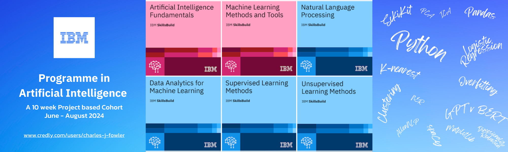
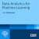

# Programme for Artifical Intelligence 2024 | IBM SkillsBuild

> **Badges**: 

## Learning Journey 

I wrote a blog on LinkedIn outline the skills and [Credly accredited badges](https://github.com/iPoetDev/ibm-skills-ai-colab-sessions/tree/main#credly) outlining the accomplishments of the coursework. Below is the top level descriptions from IBM SkillsBuild courseware modules' outlines, hereto replicated in fair use for in educational use, to provide further context to these skills and for portfolio purposes of this repository.

- Access to is granted by invitation via IBM's educational partners.
- Visit [SkillsBuild: https://skillsbuild.org/](https://skillsbuild.org/ )
  - High school & College students and educators
  - Adult Learners
  - Organisation.
- [**Contact** SkillsBuild](https://skillsbuild.org/contact)

## Live Technical Sessions Workbooks

- All were live Instructor Lead Technical sessions.
- This repository is a collection of of these sessions and their code examples using Python and Juypter notebooks.
- This demonstrates my understanding of these technologoes, approaches and the application of these labs.

See [`Sessions.md`](./Sessions.md "IBM Build Programme for AI - Colab - Sessions") for further details.

1. `Session 1`: *Python Basics.* **(2024.06.19)** 
2. `Session 2`: *Machine Learning Models and Methodologies Fundamentals. | (Unsupervised Learning)* **(2024.07.02)**
3. `Session 3`: *Generative AI Lab.* **(2024.07.16)**
4. `Session 4`:

## Coursework Modules

Three key modules:

1. **<u>Artifical Intelligence Fundamentals</u>** 1
2. **<u>Foundations in Building Machine Learning Models</u>** 2
3. **<u>Introduction of Generative AI</u>**

Two projectworks modules:

5. **Embeddable AI**
6. **Final Project**

 

- <small>1 1x Credly badge.</small>
- <small>2 5x Credly badges.</small>

> 
 
 

###  1. <ins>Artifical Intelligence Fundamentals</ins> 1

> Explores AI’s history, then see how it can change the world. Along the way, with a deep dive into ways that AI makes predictions, understands language and images, and learns using circuits inspired by the human brain.   
> After a hands-on simulation to build and test a machine learning model, and pick with tips on how to find a career in artificial intelligence.  

- i. Introduction to Artificial Intelligence   
- ii. Natural Language Processing and Computer Vision  
- iii. Machine Learning and Deep Learning  
- iv. Run AI Models with IBM Watson Studio   
- v. AI Ethics  
- vi. Your Future in AI: The Job Landscape   

#### i. Introduction to Artificial Intelligence

> In less than a century, artificial intelligence (AI) has already undergone three waves of transformative development. Today it gives humanity the most powerful tools for analyzing complex data, not only to find meaning but to learn without human intervention. Survey AI’s history and explore ways that it can shed light on unstructured data.

#### ii. Natural Language Processing and Computer Vision

> Understand how some artificial intelligence systems can understand human language, identify visual images, and even create original art and how they do it.   
> Do this by exploring the theory of natural language and vision processing, and how these technologies drive real-world mechanisms such as chatbots and photo analysis.

#### iii. Machine Learning and Deep Learning 

> Understand how machines can learn and make amazing, evidence-based predictions. Explore the logic behind computers’ ability to learn, then investigate new ways that AI systems inspired by neurons in the human brain can solve difficult problems.

#### iv.  Run AI Models with IBM Watson Studio

> Hands-on, simulated, practice creating an AI machine learning model in a series of simulations, using IBM Watson Studio.

#### iv. AI Ethics

> Understand the problems that arise when AI systems misinterpret data or propose solutions that reflect human prejudice.  
> Learn about the five pillars of AI ethics: fairness, robustness, explainability, transparency, and privacy. Through real-world examples learn about AI ethics, how they are implemented, and why AI ethics are so important in building trustworthy AI systems.

#### vi. Future in AI: The Job Landscape 

> In considering a career in artificial intelligence. Explore how the AI job market’s rapid growth and understand the skills needed for success in this exciting field. Hear how real professionals got their start, and find resources and learning opportunities to help these professionals.

 

> 
 
 

### 2. <ins>Foundations in Building Machine Learning Models</ins>

> Machine learning continues to transform technology, enabling organizations to streamline processes, optimize resource allocation, and unlock valuable insights from complex data sets that would be impractical or impossible to analyze manually.  
> This course provides the knowledge and skills to apply machine learning principles in projects.

- i. Machine Learning Methods and Tools 
- ii. Data Analytics for Machine Learning 
- iii. Supervised Learning Methods 
- iv. Natural Language Processing 
- v. Unsupervised Learning Methods

---
  
####  i. Machine Learning Methods and Tools 4

> Undesrstand about the significance, applicability, and evolution of machine learning.
> - Discover how computers learn without being explicitly programmed and
> - Explore real-world scenarios that show how machine learning applications play a pivotal role in enhancing user experience.

> Understand the evolution of machine learning, tracing its roots to its current form.

####  ii. Data Analytics for Machine Learning 5

> Understand data exploration and how data scientists understand a data set through analysis and visualization.
> - Explore the steps of data preprocessing and discover challenges with data such as inconsistent formats, outliers, duplicates, and outdated data.
> - And about bias in machine learning and how to mitigate biases using various solutions to ensure fairness in data analysis.

####  iii. Supervised Learning Methods 6

> Understand the fundamental concepts that make supervised learning an indispensable part of machine learning
> - Discover how these models transform raw data into insightful predictions and decisions. 
> - Explore a range of algorithms, such as linear regression, to advanced techniques, such as support vector machines. 
> - And about decision trees, random forests, and K-nearest neighbors.

####  iv. Natural Language Processing 7

>  Understand natural language processing (NLP) and its role in language understanding, sentiment analysis, and advanced text generation. 
> - Discover how NLP systems are designed to interpret human language, extract sentiments from textual data, and even generate coherent sentences.
> - And the relationship between natural language understanding (NLU) and natural language generation (NLG).
> - And about practical NLP techniques and models that provide valuable insights into this exciting technology.

####  v. Unsupervised Learning Methods 8

 

> Understand the principles and challenges of unsupervised learning, by: 
> - Explore the intricacies of algorithmic complexity and its implications for computational power,
> - Giving a clearer view of the resource considerations crucial in real-world applications.
> - Accepting unsupervised learning's iterative nature, which emphasizes the multiple refinements/tuning required to hone a model towards its desired outcome. 

 

> 
 
 

### 3. <ins>Introduction of Generative AI<ins>

>  In explaining how generative artificial intelligence, foundational, transformer and large lanuage modules work: 
> - Understand how deep learning plays a pivotal role in generative AI (gen-AI).
> - Applying how prompt engineering improve generative AI models.
> - As well as how gen-AI works and is applied to various industries.

> Practically explore, in live technical sessions, to create algorithms, and gain hands-on experience writing code using popular programming languages, like python and juypter notebooks.

## Guided Projectworks

### Embeddable AI 

See the public [Gist: IBM Programme for AI - Readme.md]()

> To create applications using: OpenAI, IBM Cloud® Code Engine and IBM Watson. With hands-on learning, discover how to integrate technology like Text-to-Speech, Speech-to-Text, and Natural Language Process (NLP) into your own applications. 

1. Create a Voice Assistant with OpenAI's GPT-3 and IBM Watson (Chatbot, Beginner)
2. Build a Brand Sentiment Analysis Extension for Twitter (Browser Extension, Beginner)
3. Improve Customer Support with AI-Powered Services (Web App, Intermediate)
4. How do people feel about a product? Use AI to get the answer (Full Stack, Intermediate)

### Final Project

See [IBM Programme for AI 2024 - Final Project]() repository.

## References

### Credly

IBM partners with Credly for accreditation and completion.

- 3 [Fundamentals in Artificial Intelligence, Credly.com](https://www.credly.com/go/30wgOMpM "Credly.com: Fundamentals in Artificial Intelligence, July 8 2024")
- 4 [Machine Learning Methods and Tools, Credly.com](https://www.credly.com/go/NIcXkcMR "Credly.com: Machine Learning Methods and Tools, July 8 2024")
- 5 [Data Analytics for Machine Learning, Credly.com](https://www.credly.com/go/Kcoadh4s "Credly.com: Data Analytics for Machine Learning, July 8 2024")
- 6 [Supervised Learning Methods, Credly.com](https://www.credly.com/go/X6duguki "Credly.com: Supervised Learning Methods, July 8 2024")
- 8 [Unsupervised Learning Methods, Credly.com]( https://www.credly.com/go/n0LiwX4h "Credly.com: Unsupervised Learning Methods, July 8 2024")
- 7 [Natural Language Processing, Credly.com]( https://www.credly.com/go/QNNq9fXK "Credly.com: Natural Language Processing, July 8 2024")

## Author

[Charles J. Fowler](https://github.com/ipoetdev) : [LinkedIn](https://ie.linkedin.com/in/charlesjfowler) | GitHub: [iPoetDev](https://github.com/ipoetdev)

## ChangeLog

| Date1 | Version | Changed By | Change | Activity | 
| :--- | :--- | :--- | :--- | :--- | 
| 2024-07-23  | 0.1 | Charles J Fowler  | Initial version created | Create  | 
1: `YYYY-MM-DD`