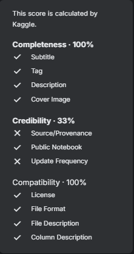

# **FINAL PROJECT**: IBM Programme for Artifical Intelligence 2024:  **Credit Card Fraud Detection** <small>Graded, Assessed</small>

## Introduction

**<ins>The Final Project</ins>**

The Final Project of IBM SkillBuild Programme for Artificial Intelligenced 2024 deals with incidence of fraud by training and evaluating of selected machine learning models and algorithms on a highly unbalanced dataset of credit card transactions. The goal is to identify which transactions are fraudulent (labeled as 1) and which are legitimate (labeled as 0).

**<ins>DataSet</ins>**

The dataset, as prepared by [@leborgne2022fraud](references.bib) of Worldline and the Machine Learning Group (http://mlg.ulb.ac.be) of ULB (Université Libre de Bruxelles, has been collected and analysed in a research collaboration on big data mining and fraud detection.

*Contains:*
- Transactions made by credit cards in September 2013 by European cardholders.
- Anonymized credit card transactions labeled as fraudulent or genuine

**<ins>Objective</ins>**

To apply the theory, utilise the hands-on live techical sessions examples in the implemenation of:

> 1️⃣ Credit Card Fraud Detection
>> *  Use python libraries and frameworks
>> *  Apply a workflow breakdown structure to the project, step by step.
>> *  Gather and discet a kaggle dataset, as provided.
>> *  Create an orginal authentic solution to the problem 

### Audience

- Technical: Data Scientists, AI Engineers, Data Analysts, AI Specialists
- Non-Technical: Those with industry or academic experince in Credit Card Fraud; AI Product Owners and AI line of business Professionals.

### The Goal

> #### The goal is to identify which transactions are fraudulent (labeled as 1) and which are legitimate (labeled as 0).

> 

### Getting Started

For a quick start, open the notebook on Google CoLab, to inspect the solution

## Table of Contents

- [Introduction]()
  - [Getting Started]()
- [Kaggle Dataset]()
- [Research]()
- [Solution]()
- [Findings]()
- [Take Aways]()
- [Summary]()

## Kaggle Dataset

This dataset is a valuable resource for studying credit card fraud detection using machine learning. The the imbalanced nature of the dataset presents an additional challenge that must be addressed when building and evaluating fraud detection models.Confidentiality of data set is protected by PCA transformation of original features; This is because these may contain sensitive information about the credit card holders or the transactions themselves

**<ins>Context</ins>**

It is important that credit card companies are able to recognize fraudulent credit card transactions so that customers are not charged for items that they did not purchase.

**<ins>CreditCard.csv</ins>**

- **`Time`**: 2 Days
- **`Transactions`**: 284,807 transactions
- **`Incidents`**: 492 frauds
- **`Positives`**: 0.172% of all transactions.

**<ins>Download</ins>**

CreditCard.csv: Local

<a href="assets/datasets/creditcard.csv"><b><ins>Download</ins></b>: &nbsp; </a> <ins>x</ins>

**<ins>Utility</ins>**

Kaggle Score Card
 
 <ins>x</ins>

- <ins>x</ins> Kaggle (2018). [": Download".](https://www.kaggle.com/datasets/mlg-ulb/creditcardfraud/data). Last Acecss: Aug 2024. https://www.kaggle.com/datasets/mlg-ulb/creditcardfraud/data
- <ins>x</ins> Kaggle (2018). ["Credit Card Fraud Detection: Utility"](https://www.kaggle.com/datasets/mlg-ulb/creditcardfraud/data). Last Acecss: Aug 2024. https://www.kaggle.com/datasets/mlg-ulb/creditcardfraud/data

### Highlights

- No details are provided on the original features and more background information about the data due to confidentiality issues.
- Contains information about credit card transactions, where each row represents a single transaction. 
- The dataset has 31 features (columns).
- Principal Component Analysis (PCA) techniques were applied to the original features into a new set of features that are uncorrelated with each other.
- Time, Ammount and Class where not transformed, and are left as-is.
- Fraudulent transactions are labeled **`1`**. legitimate are labeled **`0`**.

### Methods & Aspects

 The use of PCA to transform the original features ensures confidentiality while still preserving the important information needed for fraud detection.

#### Methods: PCA Transformation

- Is used to transform the original features into a new set of features called principal components. 
- These principal components are
    - Linear combinations of the original features.
    - Chosen in a way that maximizes the amount of variance in the data that is captured by each component.
- Due to confidentiality concerns, PCA was selected as:
    - As the original features may contain sensitive information about the credit card holders or the transactions themselves.
    - By transforming the features using PCA, the original data is obscured while still preserving the important information needed for fraud detection.

#### Aspect: Imbalanced Dataset

- An imbalanced datasets means that there are many more legitimate transactions than fraudulent ones. 
  - This is common in real-world fraud detection scenarios.
  - Fraudulent transactions are relatively rare compared to legitimate ones.

#### Challenge: Imbalanced Dataset

> The goal is to identify which transactions are fraudulent (labeled as 1) and which are legitimate (labeled as 0).

- Dealing with imbalanced datasets is an important challenge in machine learning.
- Requires special techniques to ensure that the model performs well on both classes.

## Research

The Kaggle dataset's authors, [@leborgne2022fraud](references.bib), Yann-Aël Le Borgne, Gianluca Bontempi produced the ["Reproducible machine Learning for Credit Card Fraud Detection - Practical Handbook"](https://fraud-detection-handbook.github.io/fraud-detection-handbook/Foreword.html) and on GitHub  . By publisher: [Machine Learning Group (Université Libre de Bruxelles - ULB)](https://mlg.ulb.ac.be/wordpress/) and [Worldline](https://worldline.com/).

## Solution

### Project Management

**<ins>Open Projects</ins>**  
**<ins>[Open:](https://github.com/users/iPoetDev/projects/22/views/1)</ins>** &nbsp;&nbsp; 

- Project control and iterative/agile workflows to show case the work items and plan for solving final Project for the Programme for Artificial Intelligence 2024.

### The Analysis

To view the solution in its orignal unanalysed form and in its final form, click on each button below.

| Notebook \| GitHub | **<ins>Source</ins>** | ___ | **<ins>Answer</ins>** | Date Submitted | 
| :--- | :--- | :--- | :--- | :--- | 
| [CreditCardFraudDetection_EN.ipynb](IBMSkillsBuild_ANSWER_AI_CreditCardFraudDetection_EN.ipynb) |  | ___ |  | 2024-08-dd | 

 <ins>`Opens in Google Colabatory`</ins>

## Findings

### Analysis

**<ins>Question 1</ins>**: What is the percentage of fraud transactions in the dataset? *(% percentage)*

- 

**<ins>Question 2</ins>**: What is the average transaction amount for fraud transactions? *(mean/average)*)

- 

### Visualisations

**<ins>Question 1</ins>**: How many fraud transactions are there compared to non-fraud transactions? *(A bar plot)*

-

**<ins>Question 2</ins>**: What is the distribution of transaction amounts for fraud transactions? *(A histogram)*)

-

### Model Evaluations

**<ins>Hyperparameters</ins>**

**<ins>Predictitions</ins>**

**<ins>Performance & Metrics</ins>**

**<ins>Accuracy</ins>**

## Take Aways

**<ins>Key Skills</ins>**

**<ins>Key Learnings</ins>**

**<ins>___</ins>**

# Summary

>> 

## References

## Author

## ChangeLog