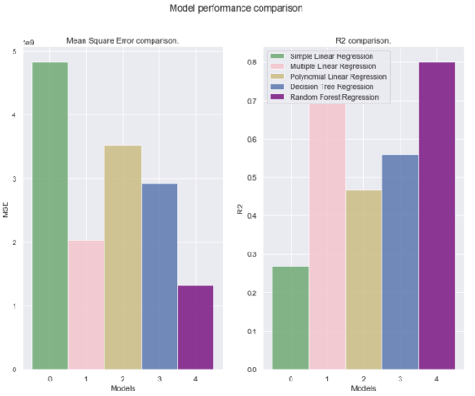

# Unsupervised Learning Methods: Regression

## Predicition with regression algorithms

### Instructions: Step 1 to 5

> - **Source**: [Unsupervised Learning Methods - YourLearning.ibm.com](https://ole03.yourlearning.ibm.com/mod/scorm/player.php?a=1105&currentorg=articulate_rise&scoid=3739&display=popup&mode=normal&lang=en "IBM SkillsBuild Registered Users")
> - *Provider*: IBM SkillsBuild
> - *Requirement*: Registration with IBM SkillsBuild.
> - *IBM PDF*: 
>   1. [Setup Intructions](https://ole03.yourlearning.ibm.com/scorm_package_symlnk/scorm_packages/MDL-423_LARS-3216/scormcontent/assets/Step%201_Create%20the%20notebook.pdf)
>   2. [Run Basic Algorithms](https://ole03.yourlearning.ibm.com/scorm_package_symlnk/scorm_packages/MDL-423_LARS-3216/scormcontent/assets/Step%202_Run%20basic%20algorithms.pdf) - Simple Linear Regressions.
>   3. [Calculate Multiple Linear Regressions](https://ole03.yourlearning.ibm.com/scorm_package_symlnk/scorm_packages/MDL-423_LARS-3216/scormcontent/assets/Step%203_Calculate%20multiple%20linear%20regression.pdf)
>   4. [Calculate Polynomial Linear Regressions](https://ole03.yourlearning.ibm.com/scorm_package_symlnk/scorm_packages/MDL-423_LARS-3216/scormcontent/assets/Step%204_Calculate%20polynomial%20linear%20regression.pdf)
>   5. [Evaluate Decision Tree](https://ole03.yourlearning.ibm.com/scorm_package_symlnk/scorm_packages/MDL-423_LARS-3216/scormcontent/assets/Step%205_Evaluate%20decision%20trees.pdf)


<br>

***
> <center>--- - ---</center>
***

<br>

## 1. Setup Instructions

- IBM Cloud Account
    - Alternate: Google CoLab

### IBM Cloud

- [ ] Create account
- [ ] Provision Cloud Object Storage.
- [ ] Provision Watson Machine Learning.
- [ ] Provision Watson Studio.
- [ ] Create an empty project.
- [ ] Add the Jupyter Notebook.

#### Resources

- Juypter Notebooks
- **IBM GitHub**: *ML-Learning-Path*: *Notebooks*: Regression with SciKit-learn.
    - https://github.com/IBM/ml-learning-path-assets
    - https://raw.githubusercontent.com/IBM/ml-learning-path-assets/master/notebooks/regression_with_scikit-learn.ipynb 
- LIbraries
    - Scikitlean | sklearn
    - mpl_toolkits
    - Pandas==0.24.2
    - Pandas_ML==0.6.1
    - Matplotib==3.1.0 <sup>`#downgrade matplotlib to bypass issue with confusion matrix being chopped out`</sup>
    - Seaborn
    - Pydot
    - graphviz

***
> <center>--- - ---</center>
***

## 2. Run Basic Algorithms

- [IBM Developer - Build and test your first machine learning model using Python and scikit-learn](https://developer.ibm.com/tutorials/build-and-test-your-first-machine-learning-model-using-python-and-scikit-learn/ "Tutorial: SciKit-Learn, Python on IBM")

> **Objective**: use a data set that contains various information that a home buyer considers before buying a house, to analyze and predict the house sales price; then compare different regression algorithms and apply it to the same data set.

### A. Steps

1. How to run individual cells in Jupyter Notebooks, observing the output before proceeding to the next cell.
2. The generated graphs, from IBM GitHub, show how the model has predicted values for test data versus the actual selling price of the test values. 

### B. Regression

> - Is when the feature to be predicted contains continuous values
> - Refers to the process of predicting a dependent variable.
> - By analysing the relationship between other independent variables. 

#### Regression Algorithms

The following are some popular regression algorithms, along with code examples.

- Linear regression (simple, multiple, and polynomial)
- Decision tree regression
- Random forest trees
- Gradient boosted trees

### C. Linear Regression

- Simple Regression
- Multiple Regression
- Polynomial Regression


***

#### Simple Regression

> - Most basic regression: the variable to be predicted depends on only one other variable.
> - Using the formula that is generally used in calculating the slope of a line:

<center><pre> y = W<sub>0</sub> + W<sub>1</sub> * X<sub>1</sub> </center></pre>

```python
# DO NOT RUN - Missing the source notebook 
# 
X = features[''].values.reshape(-1,1)

# SLR: Simple Linear Regression
X_train_slr, X_test_slr, y_train_slr, y_test_slr = train_test_slr(X, label, random_state=0) 

# Print Output
print('Dimensions of datasets for training: Input features' + str(X_train_slr.shape) + " " 
       + "Output values" + str(y_train_slr.shape))
print('Dimensions of datasets for testing: Input features' + str(X_test_slr.shape) + " " 
       + "Output values" + str(y_test_slr.shape))

```

```python
## DO NOT RUN - Missing the source notebook 
#
from sklearn.linear_model import LinearRegressor

# Name: Simple Linear Regression: sl
model_name = "Simple Linear Regression"

slRegressor = LinearRegression()
slRegressor.fit(X_train_slr, y_train_slr)

#
y_pred_slr = slRegressor.predict(X_test_slr)

# Print Output
print(slRegressor)

# Expect: LinearRegression(copy_X=True, fit_intercept=True, n_jobs=None, normalize=False)

```

```python
## DO NOT RUN
#
print('Intercept: \n', slRegressor.intercept_)
#
print('Coefficients: \n', slRegressor.coef_)

```

#### Graphs

```python
## DO NOT RUN
# 

two_vs_three(X_test_slr[:,0], y_test_slr, y_pred_slr, None, True)

# Expect: 2D and 3D view of sales price data by 
# 1. Selling Price (y) 
# 2. Year Built
# 3. Lot Area v Year Built v Selling

```

```python
## DO NOT RUN
# 

two_d_compare (X_test_slr, y_test_slr, y_pred_slr, model_name)

# Expect: Actual v Predicted Data graphs with variance score

```

```python
## DO NOT RUN
# 

slrMetrics = model_metrics(slrRegressor,y_test_slr, y_pred_slr)

# Expect: Mean Square Error and Variance Score

```

***

#### Multiple Regression

> - Is an extension to simple linear regression: the target value depends on more than one variable
> - The number of variables depends on the use case, and that all depenedent variables contribute to making effective predictions. 
> - The formulate that is used is:

<center><pre> y = W<sub>0</sub> + W<sub>1</sub>X<sub>1</sub> + W<sub>2</sub>X<sub>2</sub> + .... + W<sub>n</sub> * X<sub>n</sub></center></pre>

##### Scikit-Learn & Spiting Datasets

- Used to split datasets into i) training and ii) testing sets.
- *Assumption*: All depenedent variables contribute to making effective predictions. 
- *Out of scope*: i) Forward Selection, ii) Backward elimination
- *Libraries*: Sklearn libraries are used to develop multiple linear regression models.

```python
# DO NOT RUN - Missing the source notebook 
# 
X_train, X_test, y_train, y_test, = train_test_spilt(features, label, random_state=0)

print("Dimensions of datasets for training: Input features" + str(X_train.shape) +
      "Output values" + str(y_train.shape)

print("Dimensions of datasets for testing: Input features" + str(X_test.shape)+
      "Output values" + str(y_test.shape)

```

```python
# DO NOT RUN - Missiing the source notebook
from sklearn.learn_model import LinearRegressor

model_name = "Muliple Linear Regression"

#
mlRegressor = LinearRegression()
#
mlr_model = Pipeline(steps=[('preprocessorAll'), 
                              preprocessorForAllColumns, 
                            ('regressor', mlRegressor)])
#
mlr_model.fit(X_train, y_train)
# 
y_pred_mlr = mlr_model.predict(X_test)
#
print(mlRegressor)

```

```python
## DO NOT RUN
#
print('Intercept: \n', mlRegressor.intercept_)
#
print('Coefficients: \n', mlRegressor.coef_)

# Expect: Simple intercept, and multiple coefficicent values

```

```python
## Do NOT RUN

# 
two_vs_three(X_test['YEARBUILT'],
			 y_test,
			 y_pred_mlr
			 X_test['LOTAREA'],
			 False)

# Expect: 2D and 3D view of sales price data, inclusive of LOTAREA by 
# 1. Selling Price (y) 
# 2. Year Built
# 3. Lot Area v Year Built v Selling

```

```python
# 25
two_d_compare(X_test['YEARBUILT'],
              y_test,
              Y_pred_mlr,
              model_name)

# Expect: Actual v Predicted Data graphs with variance score

```

```python
# 26
mlrMetrics = model_metrics(mlRegressor,
						   y_test, 
						   y_pred_mlr) 

# Expect: Mean Square Error and Variance Score

```

***

#### Polynomial Regression

> - prediction line generated by simple and linear regression is usually a straight line
> - Used when a simple or multiple linear regressions does not fit the data point accurately
> - Following formula is used in the backend to generate polynomial linear regression:

<center><pre> y = W<sub>0</sub> + W<sub>1</sub>X<sub>1</sub> + W<sub>2</sub>X<sup>2</sup><sub>2</sub> + .... + W<sub>n</sub> * X<sup>n</sup><sub>n</sub></center></pre>

> - Exponents of independent variables are used, algorithm is however non-linear becauses of linear combination of coefficients.

##### Creating a Polynomial Model

1. Data is pre-processed to create exponents of variables. Max nos is mentioned in degree value.
2. If degree value is, say, `3`, this means variables to **`x3`** will be generated.
3. A *polynominal feature* with degree `1` is the same as multiple linear regressions.
4. Change the value of the *"degree""* to `1`has same output as the model in above.

**Polynomial Model Performance**

- Polynomial Performance metrics of degree 3 is not as efficient as the multiple linear model.
- **Response**: 
   1. Tune a few paramters to improve algorithmic yield for better output.
   2. Conculde that multiple linear regresssion is a better suited model for this data.

```python
## DO NOT RUN

#
X = features.iloc[:,[0,4].values
#
X_train, X_test, y_train, y_test, = train_test_spilt(features, label, random_state=0)

print("Dimensions of datasets for training: Input features" + str(X_train.shape) +
      "Output values"  + str(y_train.shape)

print("Dimensions of datasets for testing: Input features" + str(X_test.shape)+
      "" + str(y_test.shape)

```

```python
## DO NOT RUN

# SciKit Libraries
from sklearn.learn_model import LinearRegressor
from sklearn.preprocessing import PolynomialFeatures

#
model_name = "Polynomial Linear Regression"

#
degree_tuning = 3
#
polynomial_features = PolynomialFeatures(degree=degree_tuning)
plRegressor = LinearRegression()

#
plr_model = Pipeline(steps=[('polyFeature',
                              polynomial_features), 
						    ('regressor', plRegressor)])
#
plr_model.fit(X_train, y_train)
# 
y_pred_plr = plr_model.predict(X_test)
#
print(plRegressor)

```

```python
#29
print('Intercept: \n', plRegressor.intercepts_)
print('Coefficients: \n', plRegressor.coef_)

```

#### Graphs

```python
## DO NOT RUN
#30
two_vs_three(X_test[:,1],
			 y_test,
			 Y_pred_plr
			 X_test[:,0],
			 False)

```

```python
#31
two_d_compare(X_test[:,1],
              y_test,
              Y_pred_plr,
              model_name)

```

```python
# 32
plrMetrics = model_metrics(plRegressor,
                           y_test, 
						   y_pred_plr) 

```

***
> <center>--- - ---</center>
***

## 3. Decision Trees: Evaluation

- Decision Tree Models
- Ensemble Learning
- Week Models
    - Random Forest Trees
    - Gradient Boosted Trees
- Comparing Algorithms
    - MSE
    - R<sup>2</sup>

### A. Decision Tree Models

> - builds a set of rules from the training data to be able to predict the outcome.
> - is compared to trees formed through decisions.
> -  model contains *the branches* that <ins>represent the rules</ins> that lead to <ins>the path of the outcome</ins>, that is, *the leaf*.
> - Each prediction path leads to a leaf that contains multiple values.
>  -  For regression type problems, the final prediction is usually the average of all the values contained in the leaf it falls under.

```python
## DO NOT RUN

# SciKit Libraries
from sklearn.tree import DecisionTreeRegressor

#
model_name = "Decision Tree Regressor"
STATE_RAND = 0
FEATURE_MAX = 30

#
decisionTreeRegressor = DecisionTreeRegressor(random_state=STATE_RAND,
                                              max_features=FEATURE_MAX)

#
dtr_model = Pipeline(steps=[('preprocessorAll'), 
                              preprocessorForAllColumns, 
                            ('regressor', decisionTreeRegressor)])
#
dtr_model.fit(X_train, y_train)
# 
y_pred_dtr = dtr_model.predict(X_test)
#
print(decisionTreeRegressor)

```

```python
# Expect:
DecisionTreeRegressor(criterion='mse'
                        max+depth=None,
                        max_features=30,
                        max_leaf_nodes=None,
                        min_impurity_decrease=0.0,
                        min_impurity_split=2,
                        min_weigh_fraction_left=0.0),
                        presort=False,
                        random_state=0,
                        splitter='best')

```

```python
two_d_compare(X_test[''YEARBUILT'],
              y_test,
              Y_pred_dtr,
              model_name)

```

```python
dtrMetrics = model_metrics(decisionTreeRegressor,
						   y_test, 
						   y_pred_dtr) 

# Expect: Mean Square Error and Variance Score

```

### B. Ensemble Learning for Weak Models

> - **Tutorial**: Find out more in [IBM Developer - Learn classification algorithms using Python and scikit-learn](https://developer.ibm.com/tutorials/learn-classification-algorithms-using-python-and-scikit-learn/)

- **Ensemble learning** is types of algorithms that combine weak models to produce a better performing model.
  1. When two or more same algorithms are repeated to achieve this, it is called a *homogenous ensemble algorithm*.
  2. If different algorithms are assembled together, it is called a *heterogenous ensemble*.

### C. Weak Models

Decision trees are generally considered weak models because their performance usually is not 
up to the expected mark when the data set is relatively large. However, when several decision 
trees are combined into a single model, via ensemble learning, they provide greater accuracy. 

- Random  Forest Trees
- Gradient Boosted Trees

#### Random Forest Trees

> - Each decision tree within this random forest is built using a subset of the training data.
> - Number of decision trees that make this random forest is an arbitrary number 
>   - That aribrary nummber can be tuned to see the changes in accuracy.
>   - When a value to be predicted is run through this resulting model, it is the average 
of the values acquired from each of these individual trees.

```python
## DO NOT RUN

# SciKit Libraries
from sklearn.ensemble import RandomForestRegressor

#
model_name = "Random Forest Regressor"
TREE_ESTIMATORS = 100
DEPTH_MAX = 15
STATE_RAND = 0

#
randomForestRegressor = RandomForestRegressor(n_estimators=TREE_ESTIMATORS,
                                              max_depth=DEPTH_MAX,
                                              random_state=STATE_RAND)                                              )

#
rfr_model = Pipeline(steps=[('preprocessorAll'), 
                              preprocessorForAllColumns, 
                            ('regressor', randomForestRegressor)])
#
rfr_model.fit(X_train, y_train)
# 
y_pred_rfr = dtr_model.predict(X_test)
#
print(randomForestRegressor)

```

```python
two_d_compare(X_test[''YEARBUILT'],
              y_test,
              Y_pred_rfr,
              model_name)

```

```python
rfrMetrics = model_metrics(randomForestRegressor,
						   y_test, 
						   y_pred_rfr) 

# Expect: Mean Square Error and Variance Score

```

#### Gradient Boosted Trees

> - are also a type of ensemble learning that out perform random forest models
> - are based on the method called boosting and process is repeated until convergence. 
> - are models constructed by additively learning about the performance of the previous model.
>   - calculate the error from the previous model, also known as residuals.
>   - define another model that is trained on this residual.
>   - resulting model is the sum of previous model and the model trained on residuals.
> - are computationally expensive because they are built sequentially.

***
> <center>--- - ---</center>
***

## 4. Comparing algorithms: Regression 

> **Sources**: 
> - [Regression Metrics for Machine Learning](https://machinelearningmastery.com/regression-metrics-for-machine-learning/ "J Brownless, (Feb 16, 2021), Last accessed: July 15,")


**Popular Metrics**
- Mean Squared Errror (MSE)
- R<sup>2</sup>: Coefficient of Determination


### A. MSE

> - Is a fundamental metric in regression analysis, 
>   - Providing valuable insights into model performance.
>   - Serves as a basis for model optimization and comparison.
> - Is calculated by getting the mean of the squared error and is always non-negative due to squaring.
> - Penalizes larger errors more heavily than smaller ones due to squaring.
> - Is sensitive to outliers due to the squared term.
> - Error here refers to the distance between an actual and predicted value.
> - The closer the MSE is to **`0`**, the better the model performance is.

<center><pre>MSE = (1/n) * Σ(y_i - ŷ_i)^<sup>2</sup></pre></center>

- Implementation: In Python, you can easily calculate MSE using libraries like scikit-learn
    - Where y_true are the actual values and y_pred are the predicted values

```python
## DO NOT RUN

#
from sklearn.metrics import mean_squared_error

#
mse = mean_squared_error(y_true, y_pred)

```

### B. R<sup>2</sup>

> - Known as the coefficient of determination and critical for assessing the goodness-of-fit of regression models.
> - measures the proportion of variance in the dependent variable that is predictable from the independent variable(s).
> - The closer the value of R<sup>2</sup> is to **`1`**, the better the model is.
>    - Provides a measure of how well the model fits the data.
>    - Explains the variability in the target variable.
> - If the value R<sup>2</sup> is negative, it means that the model performance is poorer than just predicting the average value.

<center><pre>R<sup>2</sup> = 1 - (SS<sub><i>residual</i></sub> / SS<sub><i>average</i></sub>) </pre></center>

> - should be used in combination with other evaluation metrics and techniques to ensure a thorough model assessment.

### Graph Compare

Comparing the following Models for MSE and R<sup>2</sup>: 

- Simple Linear Regression (Green)
- Multiple Linear Regression (Pink)
- Polynomial Linear Regression (Beige)
- Decision Tree Regression (Blue)
- Random Forest Regression (Purple)



***
> <center>--- - ---</center>
***

## Queries & References

> AI knowledge queries: [Perplexity.ai](https://www.perplexity.ai)
> - [R2 in machine learning metrics - Perplexity.ai](https://www.perplexity.ai/search/r2-in-machine-learning-metrics-2k6m1ePBQYC_WtfoDcGeNQ "Prompt: R2 in machine learning metrics")
> - [MSE in machine learning metrics - Perplexity.ai](https://www.perplexity.ai/search/r2-in-machine-learning-metrics-2k6m1ePBQYC_WtfoDcGeNQ "Prompt: MSE in Machine learning metrics for regression algorithms")